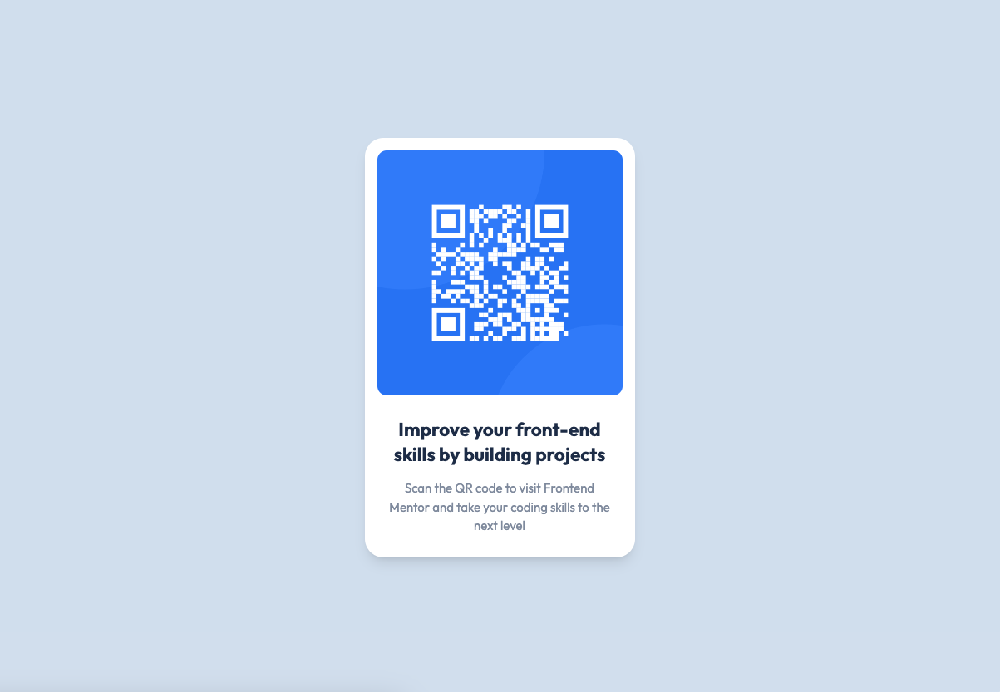

# Frontend Mentor - QR code component solution

This is a solution to the [QR code component challenge on Frontend Mentor](https://www.frontendmentor.io/challenges/qr-code-component-iux_sIO_H). Frontend Mentor challenges help you improve your coding skills by building realistic projects.

### Screenshot

### Links

- Solution URL: [GitHub Repo](https://github.com/orphandeity/qr-code-component.git)
- Live Site URL: [QR Code Component](https://orphandeity.github.io/qr-code-component/)

### Built with

- [React](https://reactjs.org/) - JS library
- [Vite](https://vitejs.dev/) - Frontend Tooling
- [TailwindCSS](https://tailwindcss.com/) - For styles

## Author

- Frontend Mentor - [@orphandeity](https://www.frontendmentor.io/profile/orphandeity)

## Acknowledgments

Shout out to [Kevin Powell](https://www.youtube.com/@KevinPowell/featured), the king of CSS! I've been following his channel for a while and he often mentions [Frontend Mentor](https://www.frontendmentor.io) as a great way to get better with CSS.
